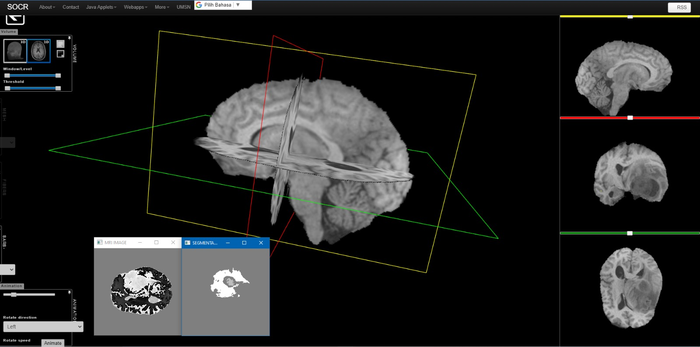

<h1 align="center">Hi 👋, I'm Muhammad Khaeral Azzam</h1>
<h3 align="center">AI Engineer from Indonesia</h3>

###

  
  
  

###

  
  
  
  
  
  
  
  
  
  
  
  
  
  
  
  
  
  
  
  
  
  
  
  
  
  
  
  
  
  
  
  
  
  
  
  
  
  
  
  
  
  
  
  
  
  
  
  
  
  
  
  
  
  
  
  
  

###

  
  

###

 

###
